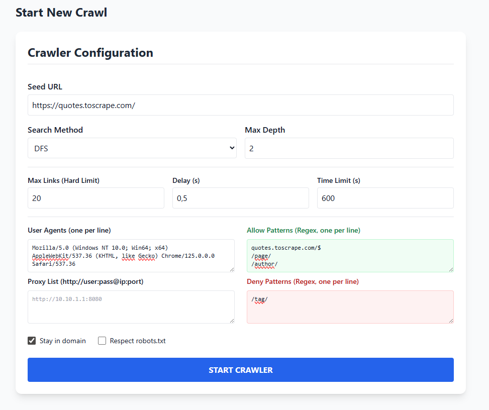
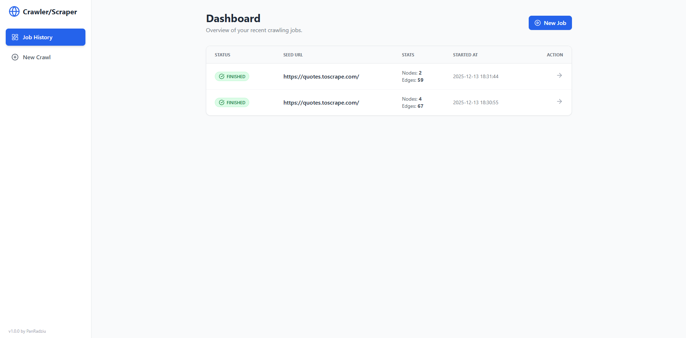
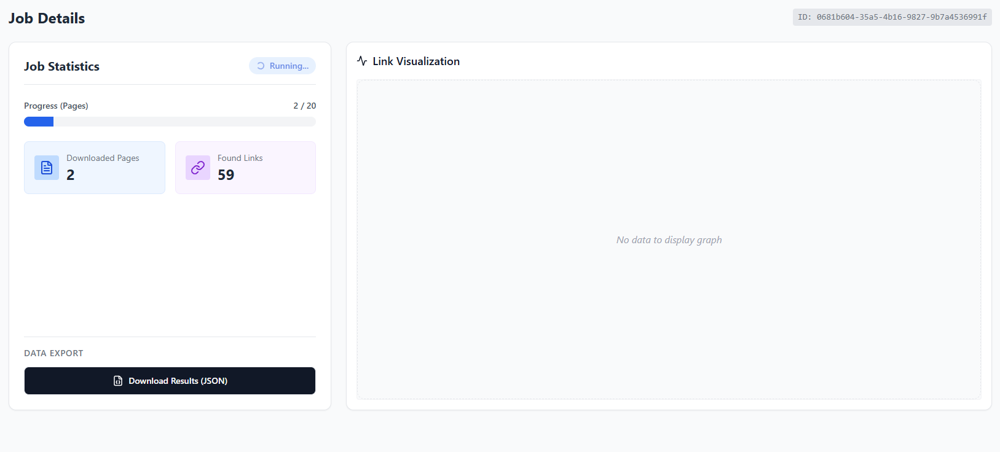
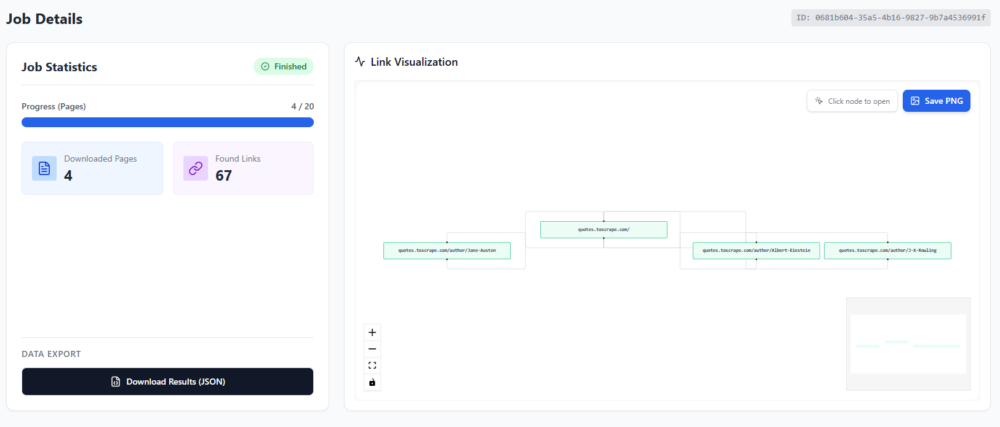
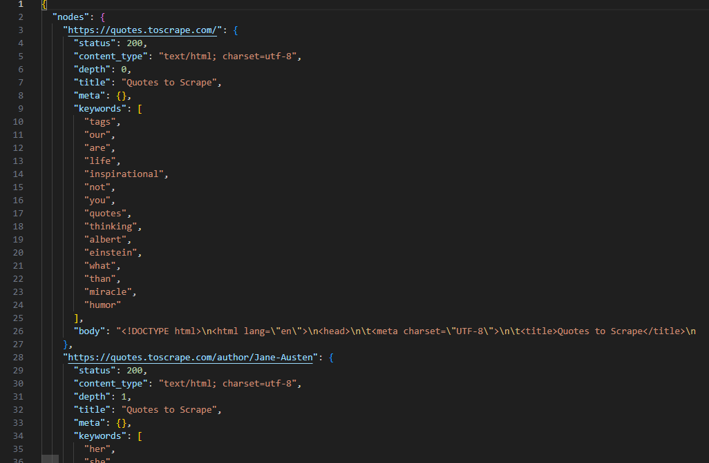
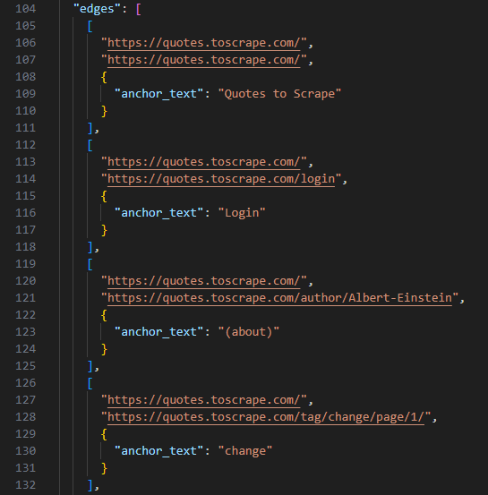
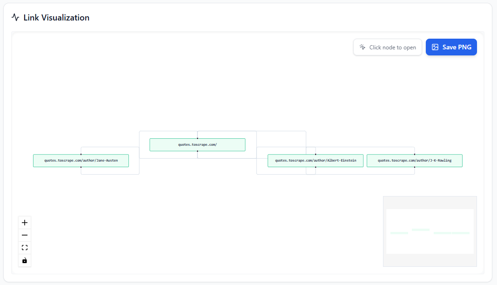

# EZI WebScrapper Crawler

Advanced web crawler and scraper with a graphical user interface. MIT Licensed.

## Features

1.  **Crawling:**
    * BFS (Breadth-First Search) and DFS (Depth-First Search) algorithms.
    * Configurable depth and link limits.
    * `robots.txt` support.
    * Option to stay within the same domain.
2.  **Security Bypassing:**
    * User-Agent rotation (configurable list).
    * Proxy support.
    * Captcha Solver adapter (API key).
3.  **Filtering:**
    * Regex for allowed and blocked links.
4.  **Export:**
    * JSON, CSV, ZIP (with full HTML content).
    * Connection graph visualization.

## Setup

The project consists of a Backend (Python/FastAPI) and a Frontend (React/Vite).

### Requirements
* Python 3.11+ (https://www.python.org/downloads/)
* Node.js 22+ (https://nodejs.org/en/download)

### Step 1: Backend

```bash
cd backend
# Create virtual environment (if it doesn't exist)
python -m venv .venv

# Activate environment
# Windows:
.\.venv\Scripts\Activate.ps1
# Linux/Mac:
# source .venv/bin/activate

# Install dependencies
pip install -r requirements.txt

# Run server
uvicorn backend_app.main:app --reload
```

The backend will start by default at `http://127.0.0.1:8000`.
API Documentation (Swagger): `http://127.0.0.1:8000/docs`.

### Step 2: Frontend

In a new terminal window:

```bash
cd frontend

# Install dependencies
npm install

# Run development server
npm run dev
```

The application will be available at (usually): `http://localhost:5173`

## User Guide

### Task Configuration (Crawler Config)

In the user interface, you can configure the following parameters:

*   **Seed URL**: Starting address (must start with http/https).
*   **Max Depth**: Crawling depth (default 3).
*   **Search Method**: `BFS` (breadth-first) or `DFS` (depth-first).
*   **Hard Link Limit**: Maximum number of visited pages (safeguard against infinite loops).
*   **Stay in Domain**: Whether the crawler should move only within the starting domain.
*   **Follow Robots.txt**: Whether to respect robots.txt rules.
*   **Max Concurrency**: Number of parallel requests (threads).

### Advanced Options

*   **User Agents**: You can provide a list of User-Agents to be randomized with each request.
*   **Proxy List**: List of proxy servers.
*   **Link Filters**: Regular expressions (Regex) for filtering links (Allow/Deny).

### Results and Export

After the task is finished, you can:
1.  View the **graph visualization** of connections between pages.
2.  Download data in formats:
    *   **JSON/CSV**: Graph structure (nodes and edges).
    *   **ZIP**: Zipped HTML files of downloaded pages.

## Project Structure

*   `backend/` - Crawler logic, API (FastAPI).
    *   `backend_app/` - Main application code.
    *   `data/` - Saved crawl results (JSON/CSV/HTML).
*   `frontend/` - User interface (React + Vite).

## Troubleshooting

*   **CORS Error**: Ensure the backend is running on port 8000 and frontend on 5173. If using other ports, update `CORS_ORIGINS` in `backend/backend_app/settings.py`.
*   **Write Permissions**: Ensure the `backend/data` folder has write permissions for the user running the script.

## Capabilities

### Crawling

Creating presets (Job) where you can define your settings:



Some explanation:
* **Search Method**: Choose between Breadth-First Search (BFS) or Depth-First Search (DFS) strategies.
* **Link Filters**: Powerful Regex patterns to control the crawler. Use `Allow` for specific paths (e.g., only `/blog/`) and `Deny` to skip unwanted content (e.g., `.pdf` files).
* **User Agents**: Optional configurable list. The crawler will select a random User-Agent for every request to mimic real browsers.
* **Proxy List**: List of proxies to bypass IP blocking.

**Running presets**

Once you have created your preset, you can see it on the Dashboard and run it:



When you run your preset, a Job is created. In the run tab, you can monitor the real-time progress:



Once the job is done, you will see a summary of downloaded pages and found links:



### Scraping

When content is fetched, the application extracts URLs, titles, meta tags, keywords, and response headers. It saves everything to local **JSON storage** (`backend/data/`) along with the data needed to represent the graph.

Here you can export scrape results to JSON (even while the run is still in progress).

**Nodes Structure (Metadata, Titles, Keywords):**


**Edges Structure (Links between pages):**



The application allows you to preview your graph visualization (which can be large!). You can interact with nodes (click to open URL) and export the graph as a high-quality **.png**:

